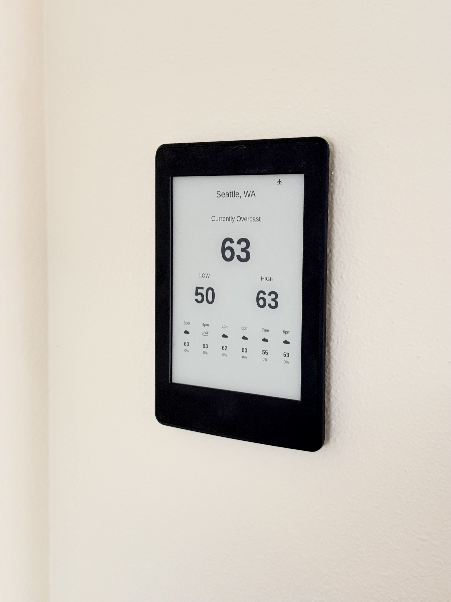

# Kindle Weather

Turn a Kindle Paperwhite into a simple weather display for your wall. Everything runs on the Kindle: no server, Raspberry Pi or always-on computer.



Shows current weather and temperature, today's low and high, and the next six hours of temperature, weather icons and rain chance. It refreshes hourly, with Wi-Fi and the frontlight off between updates. Active weather alerts and a battery warning below 20% appear when needed.

## Requirements

Currently supports **Kindle Paperwhite 3 (2015 / 7th generation), firmware 5.16.2.1.1**, with a working jailbreak, Library scriptlet launcher, FBInk with TrueType support, kTerm 2.6 and firmware updates blocked. Connect to Wi-Fi in Kindle Settings first.

Need to jailbreak? Follow the [KindleModding guide](https://kindlemodding.org/jailbreaking/WinterBreak2/). This installer installs the weather app after that step.

## Install

**One-time keyboard setup:** If kTerm is already installed, skip this step. Otherwise, download **[kterm-kindle-2.6.zip from the author's release](https://github.com/bfabiszewski/kterm/releases/download/v2.6/kterm-kindle-2.6.zip)** and extract its `kterm` folder into the Kindle's **extensions** folder using USB. Create `extensions` if needed. The resulting keyboard file should be `extensions/kterm/bin/kterm` on the Kindle. Use the ordinary ZIP for this firmware; the `-armhf` version targets newer firmware. The keyboard is downloaded separately from its original project; our package contains the Weather app and fonts.

1. [Download Weather Installer.sh](https://github.com/eric-morrison/kindle-weather/raw/refs/heads/main/Weather%20Installer.sh) to your computer. Save the file; do not run it on the computer.
2. Connect the Kindle by USB and copy that file into its **documents** folder.
3. Safely eject and unplug. Open **Weather Installer** in the Kindle Library.
4. Read the installation notice, type **YES**, and press Enter.
5. Weather opens automatically. Enter a five-digit US ZIP. On a fresh device, wait for the one-minute sleep/wake test and press Power when prompted.

No ZIP is preset. Updates preserve your saved ZIP and weather data and back up previous Weather files under `weather-backups/` on the Kindle. The installer uses your existing keyboard. If it is missing or incomplete, installation stops before changing Weather files.

Prefer manual installation? Complete the keyboard setup above, then extract [the fresh-install ZIP](https://github.com/eric-morrison/kindle-weather/raw/refs/heads/main/PaperWhite-weather-fresh-install.zip) into the Kindle's USB root, safely eject, and open **Weather**. Checksums for both Weather downloads are in [SHA256SUMS](SHA256SUMS).

## Use

Press **Power** to return to the Library. Open **Weather Settings** to change ZIP, or **Weather** to return to the display. Temperatures are Fahrenheit; ZIP setup supports US locations.

Weather installs automatic startup after device setup passes. It opens again after a restart. Battery life has not yet been measured.

The running display has been used on a physical Paperwhite 3. The new installer has automated installation, cancellation and rollback checks; its on-device confirmation flow still needs a physical check. Reboot into Weather and reliable Power wake from deep sleep also need confirmation. Failed downloads keep cached weather with a small failure message.

## Develop and contribute

App source is in `kindle-weather/`; installer source is in `installer/`. Run:

```sh
python3 -m unittest test_weather test_installer
python3 build_installer.py
```

The builder runs offline and packages no device state or third-party executables. See [development notes](docs/DEVELOPMENT.md) for rendering previews, app internals and disabling automatic startup. Issues and pull requests are welcome.

## License and credits

Our code is [MIT licensed](LICENSE), with the reused MIT project's notice retained. Bundled fonts keep their SIL Open Font Licenses. kTerm and FBInk are separately installed dependencies under their upstream licenses. See [third-party notices](THIRD_PARTY.md).

Weather: [Open-Meteo](https://open-meteo.com/). Alerts: [National Weather Service](https://www.weather.gov/documentation/services-web-api). ZIP lookup: [Zippopotam.us](https://www.zippopotam.us/).
