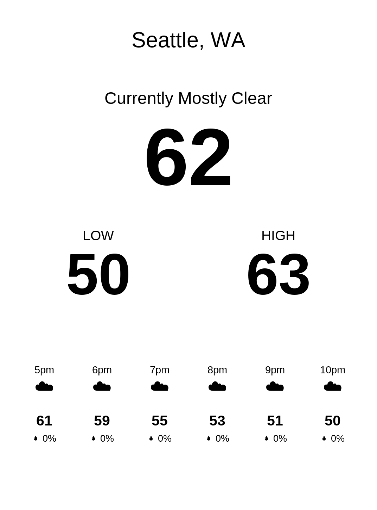

# Kindle Weather

A simple weather wall display that runs entirely on a jailbroken Kindle Paperwhite. The Kindle downloads weather over its saved Wi-Fi network, draws the forecast, turns off Wi-Fi and the frontlight, and sleeps until the next clock hour. No server or always-on computer is needed.



The display shows the city, current conditions and temperature, today's low on the left and high on the right, and the next six hours of temperature, weather symbols and rain chance. Active National Weather Service alerts appear when available. A small low-battery warning appears below 20%.

Temperatures are Fahrenheit. ZIP setup and changes happen on the Kindle. Fresh installations have no preset ZIP or saved weather.

## Supported device

The current hardware checks target **Paperwhite 3 (2015, 7th generation), firmware 5.16.2.1.1**. This is a device-specific homebrew project; other models and firmware need their own hardware checks.

Before installing, the Kindle needs:

- A working jailbreak and Library scriptlet launcher with root access.
- Firmware updates blocked. Setup checks for the disabled `otaupd` updater.
- FBInk with TrueType support at `/mnt/us/libkh/bin/fbink`.
- kTerm 2.6 installed separately at `/mnt/us/extensions/kterm/` from the author's official release (ordinary soft-float ZIP for this firmware).
- A saved Wi-Fi network and an accurate system clock.

The weather archive does not jailbreak the Kindle. Start with the [KindleModding guides](https://kindlemodding.org/jailbreaking/WinterBreak2/) for that step.

## Install

1. Complete the one-time keyboard setup in the [README](../README.md), then download `PaperWhite-weather-fresh-install.zip` from this repository.
2. Connect the prepared Kindle by USB. Extract the archive into the root of its USB storage. It supplies `weather/` and the Weather launchers in `documents/`.
3. Safely eject and unplug the Kindle. Connect to Wi-Fi through the Kindle's normal settings.
4. Open **Weather** in the Library and enter a five-digit US ZIP using the on-screen keyboard.
5. On a new device, leave it unplugged for the one-minute sleep/wake check. Press Power when prompted to finish the button check. Weather starts after successful setup.

Press Power once to return to the Library. Open **Weather Settings** to change the ZIP, then reopen Weather. To use a different network, connect through the Kindle's normal Wi-Fi settings first.

The archive contains no device state, cached weather, ZIP or hardware-verification marker. When updating an existing installation, preserve `weather/state/` and your other Kindle files.

## Startup and battery

Weather installs `/etc/upstart/paperwhite-weather.conf` on its first successful launch. This job starts Weather after normal Kindle startup, once per kernel boot. Returning to the Library with Power does not immediately reopen Weather.

To disable automatic startup from a root terminal on the Kindle:

```sh
mntroot rw
rm /etc/upstart/paperwhite-weather.conf
mntroot ro
```

Weather uses an RTC alarm and `mem` suspend between hourly updates. Battery readings are kept in `weather/state/battery.csv`; battery life has not yet been measured. Battery status is checked when Weather opens and at each refresh: below 20% shows a warning; 100% with `com.lab126.powerd isCharging` reporting connected power shows “Charged”. Missing or invalid readings hide the charge message.

Wi-Fi turns off before the weather frame is cleared and drawn, with a short pause for the native status update. This should prevent its airplane icon from appearing over the finished frame; the result still needs a physical check. On days without alerts, the hourly strip sits slightly lower. Active alerts retain their reserved space.

If a forecast request fails, the last successful weather remains visible with a small failure message. Alerts are checked hourly, so this display should not be treated as a real-time alert service.

## Source

| File | Purpose |
| --- | --- |
| `kindle-weather/runtime.sh` | Lifecycle, power-button handling, Wi-Fi, RTC wake and suspend |
| `kindle-weather/dashboard.sh` | Weather and alert downloads, cached data |
| `kindle-weather/weather-json.awk` | Validated JSON parsing and forecast formatting |
| `kindle-weather/display.sh` | Centered FBInk typography and hourly strip |
| `kindle-weather/common.sh` | ZIP validation, stored settings and scheduling |
| `kindle-weather/settings.sh`, `first-run.sh` | On-device setup and ZIP changes through kTerm |
| `kindle-weather/device-setup.sh` | Bounded first-install hardware verification |
| `kindle-weather/autostart.sh` | Reversible startup-job installation |
| `test_weather.py` | Offline parser, settings, lifecycle and scheduling tests |
| `preview_weather.py` | Local Pillow preview of the production text bands |

`prepare_kindle.py` preserves the original Mac USB preparation helper. It has a pinned WinterBreak2 archive hash and a dated backup prerequisite; it is not a general installer and is not needed for an already prepared Kindle.

Run the offline tests with:

```sh
python3 test_weather.py
```

The preview tool requires Pillow and a directory containing sample state files:

```sh
python3 preview_weather.py /path/to/sample-state weather-preview.png
```

The preview approximates FBInk's font sizing. The physical Kindle remains the final layout check.

## Validation and remaining checks

The display and on-device ZIP workflow have been used on a physical Paperwhite 3. The setup check passed weather access, timed suspend/wake, Wi-Fi reconnect and Power input while awake. Automatic startup installation was verified on the device.

An actual reboot into Weather, reliable Power wake from deep sleep, and battery endurance still need physical confirmation. Firmware updates and hardware differences can affect the sleep and input paths.

## Data and dependencies

- [Open-Meteo](https://open-meteo.com/) supplies weather.
- [US National Weather Service](https://www.weather.gov/documentation/services-web-api) supplies active alerts.
- [Zippopotam.us](https://www.zippopotam.us/) resolves US ZIP codes.
- [FBInk](https://github.com/NiLuJe/FBInk) draws the screen; it is provided by the prepared Kindle environment.
- [kTerm 2.6](https://www.fabiszewski.net/kindle-terminal/) supplies the settings keyboard. Install it separately from the author's official release; it is not bundled here.
- Liberation Sans and Noto Sans Symbols 2 fonts retain their SIL Open Font License files in `kindle-weather/fonts/`.
- The bundled US time-zone files come from the setup Mac's installed IANA time-zone database and are public domain.

Device backups, downloaded setup tools, runtime state and local installation reports are excluded from version control.
